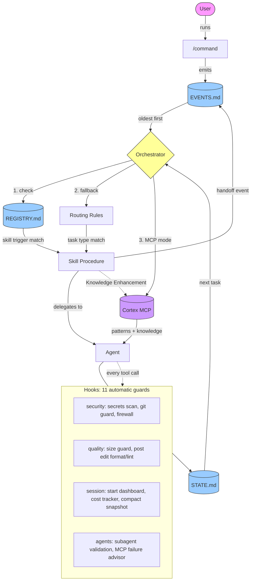

# Bashi

[](https://www.npmjs.com/package/create-bashi-app)
[](https://github.com/BasharAmso/bashi/releases)
[](https://github.com/BasharAmso/bashi/stargazers)
[](https://opensource.org/licenses/MIT)

> **Never used Claude Code before?** [Start here -- Beginner's Guide](docs/BEGINNERS_GUIDE.md)

**You can architect, design, and direct. Writing code line-by-line blocks you from shipping.** This framework turns Claude Code into a structured development team that builds while you direct.

**Recommended** (600+ skills via [Cortex MCP](https://github.com/BasharAmso/cortex-mcp)):
```
npm install -g cortex-mcp-server
cd your-project
npx create-bashi-app --light
```

**Standalone** (37 built-in skills, no setup needed):
```
cd your-project
npx create-bashi-app
```

12 agents. 20 commands. 11 safety hooks. Zero dependencies.

---

## What It Does

Describe what you want to build. The system figures out what to do next.

Instead of a blank AI chat, you get a dispatch chain that routes every task to the right agent with the right process. Independent tasks run in parallel across isolated git worktrees, then merge back automatically. You stay in control. Every action is reviewed before the next one starts.

```
/start             See where you are and what to do next
/capture-idea      Describe what you want to build
/run-project       Start building (generates PRD, breaks into tasks, executes)
```

## Who It's For

If you can think in systems but hit a wall when it's time to code, this was built for you. Run the install command, open in VS Code with Claude Code, and start building by describing what you want in plain language.

## Prerequisites

**1. A computer** (Windows, Mac, or Linux)

**2. [Node.js](https://nodejs.org)** -- click the LTS button and install with defaults

**3. [Claude Code](https://docs.anthropic.com/en/docs/claude-code/overview)** -- install via:
- **[VS Code](https://code.visualstudio.com)** (recommended): Claude Code extension from the Extensions sidebar
- **JetBrains IDEs**: Claude Code plugin
- **Terminal**: Claude Code CLI

**4. A [Claude subscription](https://claude.ai/pricing)** (Pro or Max plan)

No programming languages to learn, no build tools, no package managers. The framework is pure markdown and shell scripts. New to all of this? See the [Beginner's Guide](docs/BEGINNERS_GUIDE.md) for step-by-step setup with screenshots.

## Quick Start

### Recommended (with Cortex MCP)

600+ skills across 26 domains, loaded on-demand:

1. `npm install -g cortex-mcp-server`
2. `cd your-project`
3. `npx create-bashi-app --light`
4. Open in VS Code with Claude Code, type `/start`

### Standalone (no setup needed)

37 built-in skills, works everywhere:

1. `cd your-project`
2. `npx create-bashi-app`
3. Open in VS Code with Claude Code, type `/start`

> **Starting fresh?** `npx create-bashi-app my-app` creates a new directory.

## Token Efficient by Design

The framework loads ~700 tokens at startup (0.07% of the context window). Skills, agents, and knowledge files load only when needed. In MCP mode, skills aren't even on disk — they're fetched from Cortex on-demand, keeping your project directory light. State persists across sessions so you never re-explain your project. Chat output stays concise while artifacts go to files.

## What's Inside

```
.claude/
  CLAUDE.md            Context index (loaded by Claude on startup)
  agents/              12 specialized AI agents (builder, reviewer, coach, etc.)
  commands/            20 entry point commands
  rules/               4 routing and governance policies
  skills/              37 built-in task procedures + registry
  hooks/               11 automatic guards (security, quality, session mgmt)
  project/
    STATE.md           Current project status (single source of truth)
    EVENTS.md          Event queue (things to process)
    IDENTITY.md        Project identity lock (survives upgrades)
    knowledge/         Decisions, research, glossary, open questions
custom-skills/         8 additional skills (security, marketing, growth)
```

## Two-Mode Knowledge Loading (v2.0.0)

The framework supports two knowledge sources:

| Mode | How It Works |
|------|-------------|
| **Standalone (default)** | Loads agents and skills from `.claude/` files. Works everywhere, no setup needed. |
| **MCP-connected** | Queries [Cortex MCP](https://github.com/BasharAmso/cortex-mcp) for on-demand knowledge with smart context (related patterns and examples). Falls back to files if MCP is unavailable. |

In MCP mode, the orchestrator auto-loads related patterns (up to 2) and examples (up to 1) alongside the primary skill, giving agents richer context. Difficulty-based skill selection adapts to your experience level. Update Cortex once, and every Bashi project benefits automatically — no framework update needed.

## Commands

20 commands, but you only need 3 to get started. The rest are there when you need them.

### Core: Every Session

| Command | What It Does | When to Use |
|---------|-------------|-------------|
| `/start` | Orients you: shows current phase, active task, and suggests the next action. | Beginning of every session. |
| `/run-project` | Executes the next unit of work: processes events, runs skills, advances tasks. | The main loop. Run it repeatedly to make progress. |
| `/save` | Persists all progress to files so the next session picks up where you left off. | End of every session, or before stepping away. |

### Periodic: When Needed

The system suggests these at the right time. You don't need to memorize them.

| Command | What It Does | When to Use |
|---------|-------------|-------------|
| `/setup` | Creates project structure, runtime files, and initial task queue. | Once, at project start. |
| `/capture-idea` | Walks you through describing what you want to build in plain language. | When you have a new project idea or feature concept. |
| `/status` | Dashboard view: phase, mode, progress percentage, active task, queue. | When you want a quick snapshot without starting work. |
| `/set-mode` | Switches execution speed (Safe / Semi-Auto / Autonomous) or planning depth (Full / Quick). | When you want more automation or want to slow down for review. |
| `/trigger` | Manually fires a workflow event (e.g., `DEPLOY_REQUESTED`, `BUG_REPORTED`). | When you need to kick off a specific workflow outside the normal flow. |
| `/doctor` | Runs 10+ diagnostics on your environment with optional auto repair. | After upgrades, when something feels broken, or before sharing the project. |
| `/clone-framework` | Copies or upgrades the framework into another project directory. | When starting a new project or upgrading an existing one to the latest version. |
| `/retro` | Engineering retrospective: analyzes commits, work patterns, and code quality metrics. | End of a sprint or week, or when you want to reflect on progress. |
| `/overnight` | Runs the project unattended with git verification, circuit breakers, auto learning, and a morning summary. | Before stepping away for hours when you have a full task queue and want progress without you. |

### Maintenance and Diagnostics: Rare

| Command | What It Does | When to Use |
|---------|-------------|-------------|
| `/capture-lesson` | Saves a reusable insight to global memory for cross project learning. | When you discover something that would help future projects. |
| `/learn` | Analyzes the current session and extracts reusable lessons automatically. | End of a productive session. Let the system find its own lessons. |
| `/cleanup` | Reviews knowledge files for staleness and recommends cleanup. | When knowledge files feel bloated or outdated. |
| `/fix-registry` | Rebuilds the Skills Registry so the orchestrator can discover all workflows. | After adding/removing skills, or if `/doctor` flags registry issues. |
| `/test-framework` | Validates framework structure, dispatch chain, and file consistency. | After modifying framework files or before a release. |
| `/test-hooks` | Smoke tests all 11 hooks. Verifies they fire and block correctly. | After modifying hooks or upgrading the framework. |
| `/test-skill` | Validates skill files for structural completeness, quality signals, and registry consistency. | After adding or modifying skills. |
| `/log-session` | Logs session quality metrics to the global progress tracker. | When you want to track productivity trends over time. |
| `/framework-review` | Deep review of framework health, unused components, and improvement opportunities. | Periodic framework maintenance (monthly or after major milestones). |

## Framework Mode

Choose how much planning happens before building. Set during `/start` or change anytime with `/set-mode`.

| Mode | What Happens |
|------|-------------|
| **Quick Start** | Scaffold first, plan as you go. Describe your idea in 3 questions, get a working app immediately, add features one at a time. |
| **Full Planning** *(Default)* | Plan before you build. Write a detailed PRD, design the architecture, break it into tasks, then build systematically. |

## Run Modes

Control how fast work happens within either framework mode.

| Mode | What Happens |
|------|-------------|
| **Safe** | Propose actions only. No files are modified. |
| **Semi-Autonomous** | Execute one safe cycle and pause for review. *(Default)* |
| **Autonomous** | Execute up to 10 cycles before stopping (configurable in RUN_POLICY.md). |

## Parallel Execution

When the task queue has 2+ independent tasks at the same priority, the orchestrator dispatches them simultaneously in separate git worktrees. Each agent works in isolation, then results merge back one at a time.

- **Auto-detection** identifies independent tasks by skill type
- **Up to 3 parallel agents** per cycle (configurable)
- **Sequential merge** eliminates race conditions
- **Conflict resolution** re-queues conflicted tasks automatically
- **Circuit breaker** stops if 2+ merge conflicts occur

## Overnight Mode

For unattended runs, `/overnight` activates Autonomous mode with execution hardening:

- **Git verification** confirms tasks actually changed files (detects phantom completions)
- **Circuit breakers** stop after 3 consecutive failures or 4 hours
- **Inter-cycle commits** one git commit per task for clean history
- **Auto-compaction** compresses context every 8 cycles
- **Auto-learning** extracts lessons when done
- **Morning summary** writes `docs/OVERNIGHT_SUMMARY.md` with full results

```
/overnight              defaults (50 cycles, 4 hours)
/overnight --cycles 20  limit cycles
/overnight --hours 2    limit time
/overnight --pr         create PR when done
```

## Mobile Development

Build native mobile apps with the same structured workflow:

| Platform | Stack | Best For |
|----------|-------|----------|
| **React Native + Expo** | Cross platform JavaScript | Ship to both stores with one codebase |
| **Swift/SwiftUI** | Native iOS (MVVM + @Observable) | iOS only apps needing platform specific polish |
| **Kotlin/Jetpack Compose** | Native Android (MVVM + StateFlow + Hilt) | Android only apps needing native performance |

## Self-Improving Agents

Agents evaluate their own work after each task. Cross-agent feedback captures review failures with pattern tags. When the same pattern appears 3+ times, the system proposes a skill improvement. All proposals are logged for human review -- nothing auto-modifies.

## Architecture



## Origin Story

I always wanted to build apps, but I never had the passion to write code. My expertise came in the form of providing structure to projects and keeping things moving. I could architect, think through systems, and direct. But actually shipping? That's where I kept getting stuck.

When Claude Code came along, I quickly realized that setting up a framework was the most important step. Without structure, the AI does great work for a few turns and then loses context, contradicts itself, or goes in circles. With structure, it becomes a reliable development team.

There's a book by Uri Levine called "Fall in Love with the Problem, Not the Solution." The problem I fell in love with is simple: how do you ship software when writing code isn't your strength? I built [scriptureguide.org](https://scriptureguide.org) because I wanted to connect how I feel in the moment with scripture. I built an educational game because my daughter needed a fun way to learn. The framework came from needing a reliable way to ship all of it.

Bashi was originally called The AI Orchestrator System.

## Learn More

- **[CLAUDE.md](.claude/CLAUDE.md)** Architecture index and context loading rules
- **[Custom Skills Guide](docs/CUSTOM_SKILLS_GUIDE.md)** How to create your own skills
- **[Framework Scope](docs/FRAMEWORK_SCOPE.md)** The conceptual "why" behind the framework
