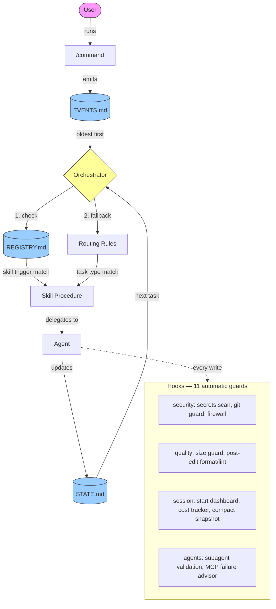

# The AI Orchestrator System

The AI Orchestrator System is a reusable project template that turns Claude Code into a structured software development team. Copy this folder into any new project (a web app, mobile app, API, or SaaS product), open it in VS Code with Claude Code, and start building by describing what you want in plain language.

Instead of a blank AI chat, you get 12 specialized agents, 26 skill procedures, 11 safety hooks, and a dispatch chain that routes every task to the right agent with the right process. You stay in control: every action is reviewed before the next one starts.

## The Naming Stack

| Layer | Name | What It Means |
|-------|------|---------------|
| **Problem** | The Syntax Wall | You can design systems, think architecturally, and manage projects — but writing code line-by-line blocks you from shipping. |
| **Method** | AI Orchestration Framework | A structured method for coordinating AI agents, skills, and events so the AI builds while you direct. |
| **Tool** | The AI Orchestrator System | This template — the ready-to-use implementation of the framework for software development. |

## Quick Start

1. **Copy** this entire folder into a new directory (or use `/clone-framework`).
2. **Rename** it to match your project (e.g., `my-cool-app`).
3. **Open** the folder in VS Code with Claude Code installed.
4. **Run these commands** in order:

```
/start             — See where you are and what to do next
/setup             — Create project structure and runtime files
/capture-idea      — Describe what you want to build
/run-project       — Start processing (generates PRD, seeds tasks)
```

That's it. The system will guide you from there.

## What's Inside

```
.claude/
  CLAUDE.md            — Context index (loaded by Claude on startup)
  agents/              — 12 specialized AI agents (builder, reviewer, coach, etc.)
  commands/            — 19 entry-point commands
  rules/               — 4 routing and governance policies
  skills/              — 26 reusable task procedures + registry
  hooks/               — 11 automatic guards (security, quality, session mgmt)
  project/
    STATE.md           — Current project status (single source of truth)
    EVENTS.md          — Event queue (things to process)
    IDENTITY.md        — Project identity lock (survives upgrades)
    knowledge/         — Decisions, research, glossary, open questions
```

## Core Commands

These 5 commands cover the entire workflow. You'll use them in almost every session.

| Command | What It Does |
|---------|-------------|
| `/start` | See where you are and what to do next. |
| `/setup` | Set up the project structure and runtime files. |
| `/capture-idea` | Describe what you want to build in plain language. |
| `/run-project` | Do the next piece of work (process events and tasks). |
| `/save` | Save your progress so the next session picks up where you left off. |

### Power User Commands

These are available when you need them. The system will suggest them at the right time.

| Command | What It Does |
|---------|-------------|
| `/status` | Show a project dashboard: phase, mode, progress, active task, queue. |
| `/set-mode` | Switch between Safe, Semi-Autonomous, and Autonomous execution modes. |
| `/trigger` | Manually trigger a workflow by adding an event. |
| `/fix-registry` | Rebuild the Skills Registry so the orchestrator can discover available workflows. |
| `/doctor` | Run diagnostics to verify the environment is healthy, with optional auto-repair. |
| `/clone-framework` | Copy or upgrade the The AI Orchestrator System into another project directory. |
| `/capture-lesson` | Save a reusable insight to global memory for cross-project learning. |
| `/learn` | Analyze the current session and extract reusable lessons automatically. |
| `/cleanup` | Review knowledge files for staleness and recommend cleanup. |
| `/retro` | Run an engineering retrospective on recent work. |
| `/test-framework` | Validate framework structure, dispatch chain, and file consistency. |
| `/test-hooks` | Smoke-test all hooks — verify they fire and block correctly. |
| `/log-session` | Log session quality metrics to the global progress tracker. |
| `/framework-review` | Deep review of framework health, unused components, and improvement opportunities. |

### Recommended First-Time Flow

```
1. /start            — See where you are and what to do next
2. /setup            — Create project structure and runtime files
3. /capture-idea     — Describe what you want to build
4. /run-project      — Process the idea (generates PRD, seeds tasks)
5. /run-project      — Execute the first task from the queue
```

## Framework Mode

Choose how much planning happens before building. Set during `/start` or change anytime with `/set-mode`.

| Mode | What Happens |
|------|-------------|
| **Quick Start** | Scaffold first, plan as you go. Describe your idea in 3 questions, get a working app immediately, add features one at a time. Planning docs grow with the code. |
| **Full Planning** *(Default)* | Plan before you build. Write a detailed PRD, design the architecture, break it into tasks, then build systematically. Best for complex projects. |

Switch with `/set-mode quick-start` or `/set-mode full-planning`. The system adapts: in Quick Start mode, if your project grows complex (10+ tasks, multiple integrations), the framework will suggest switching to Full Planning.

## Run Modes

Control how fast work happens within either framework mode.

| Mode | What Happens |
|------|-------------|
| **Safe** | Propose actions only. No files are modified. |
| **Semi-Autonomous** | Execute one safe cycle and pause for review. *(Default)* |
| **Autonomous** | Execute up to 10 cycles before stopping (configurable in RUN_POLICY.md). |

Switch modes with `/set-mode safe`, `/set-mode semi`, or `/set-mode auto`. Cycle limits and stop conditions are defined in [.claude/project/RUN_POLICY.md](.claude/project/RUN_POLICY.md). The current mode is shown in [.claude/project/STATE.md](.claude/project/STATE.md).

## Global Memory

The AI Orchestrator System supports cross-project learning. All reusable knowledge — decisions, patterns, failures, and lessons — is stored in a separate **AI-Memory** directory that lives outside any single project.

> **Setup:** Create an `AI-Memory` folder on your machine (e.g., alongside your projects) and set the `AI_MEMORY_PATH` environment variable to point to it. See the `/capture-lesson` command for details.

This allows future projects to benefit from past discoveries. The orchestrator checks global memory before major architectural work and writes new insights back when they emerge.

## Self-Improving Skills

The AI Orchestrator System can capture proposed improvements to reusable skills. When the orchestrator notices a skill causing repeated friction or rework, it logs a proposal in `SKILL_IMPROVEMENTS.md` inside your AI-Memory folder.

Skills do not rewrite themselves automatically. Instead, the system logs proposed improvements for later review and approval. This keeps the improvement loop safe and human-controlled.

## Architecture

How commands, events, skills, and agents connect:



**Dispatch chain:** `Events → Skills (via REGISTRY) → Agents (via routing rules) → State updates`

## Learn More

- **[User Guide](docs/USER_GUIDE.md)** — Step-by-step walkthrough for first-time users.
- **[Custom Skills Guide](docs/CUSTOM_SKILLS_GUIDE.md)** — How to create your own skills.
- **[Framework Scope](docs/FRAMEWORK_SCOPE.md)** — The conceptual "why" behind the framework.
- **[CLAUDE.md](.claude/CLAUDE.md)** — Architecture index and context loading rules (loaded by Claude Code automatically).
